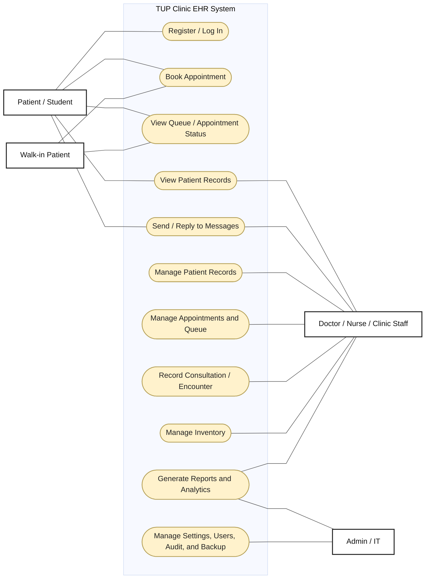

# TUP Clinic EHR - General Use Case Diagram

This is a simplified general use case diagram for the current TUP Clinic EHR app. It follows the simple format shown in the reference: actors outside the system boundary, main system use cases inside, and direct association lines.

**Figure:** General Use Case Diagram of the TUP Clinic EHR System

**Actors**

- Patient / Student: uses the online patient portal.
- Walk-in Patient: uses the kiosk booking flow.
- Doctor / Nurse / Clinic Staff: manages clinical and operational workflows.
- Admin / IT: handles administrative, audit, backup, and system settings workflows.
