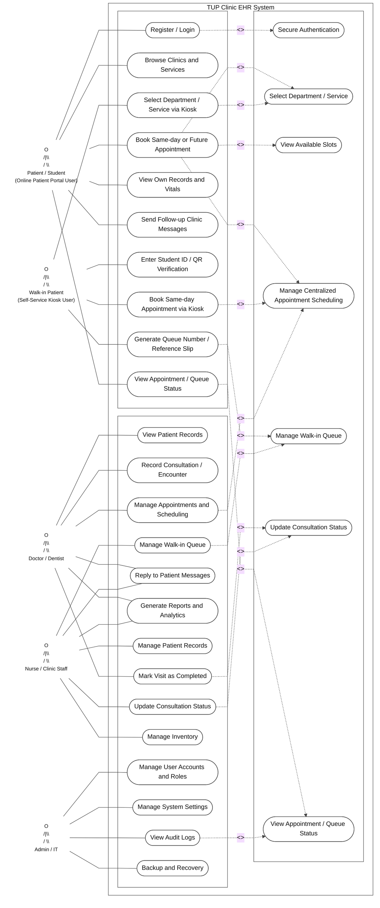

# TUP Clinic EHR - General Use Case Diagram

```mermaid
%%{init: {"theme":"base","themeVariables":{"primaryTextColor":"#111","lineColor":"#444","fontFamily":"Arial"},"flowchart":{"curve":"linear","nodeSpacing":38,"rankSpacing":48}}}%%
flowchart LR

  PAT["O<br/>/|\\<br/>/ \\<br/>Patient / Student<br/>(Online Patient Portal User)"]
  WLK["O<br/>/|\\<br/>/ \\<br/>Walk-in Patient<br/>(Self-Service Kiosk User)"]
  DOC["O<br/>/|\\<br/>/ \\<br/>Doctor / Dentist"]
  NUR["O<br/>/|\\<br/>/ \\<br/>Nurse / Clinic Staff"]
  ADM["O<br/>/|\\<br/>/ \\<br/>Admin / IT"]

  subgraph SYS["TUP Clinic EHR System"]
    direction LR

    subgraph LEFT[" "]
      direction TB
      P1([Register / Login])
      P2([Browse Clinics and Services])
      P3([Book Same-day or Future Appointment])
      P4([View Appointment / Queue Status])
      P5([View Own Records and Vitals])
      P6([Send Follow-up Clinic Messages])
      K1([Enter Student ID / QR Verification])
      K2([Select Department / Service via Kiosk])
      K3([Book Same-day Appointment via Kiosk])
      K4([Generate Queue Number / Reference Slip])
    end

    subgraph MID[" "]
      direction TB
      C1([Secure Authentication])
      C2([Select Department / Service])
      C3([View Available Slots])
      C4([Manage Centralized Appointment Scheduling])
      C5([Manage Walk-in Queue])
      C6([Update Consultation Status])
      C7([View Appointment / Queue Status])
    end

    subgraph RIGHT[" "]
      direction TB
      D1([View Patient Records])
      D2([Record Consultation / Encounter])
      D3([Mark Visit as Completed])
      D4([Manage Appointments and Scheduling])
      D5([Reply to Patient Messages])
      D6([Generate Reports and Analytics])
      N1([Manage Patient Records])
      N2([Manage Walk-in Queue])
      N3([Update Consultation Status])
      N4([Manage Inventory])
      A1([Manage User Accounts and Roles])
      A2([Manage System Settings])
      A3([View Audit Logs])
      A4([Backup and Recovery])
    end
  end

  PAT --- P1
  PAT --- P2
  PAT --- P3
  PAT --- P4
  PAT --- P5
  PAT --- P6

  WLK --- K1
  WLK --- K2
  WLK --- K3
  WLK --- K4

  DOC --- D1
  DOC --- D2
  DOC --- D3
  DOC --- D4
  DOC --- D5
  DOC --- D6

  NUR --- N1
  NUR --- N2
  NUR --- N3
  NUR --- N4
  NUR --- D5
  NUR --- D6

  ADM --- A1
  ADM --- A2
  ADM --- A3
  ADM --- A4

  P1 -. "<<include>>" .-> C1
  P3 -. "<<include>>" .-> C2
  P3 -. "<<include>>" .-> C3
  P3 -. "<<include>>" .-> C4
  P4 -. "<<include>>" .-> C7

  K2 -. "<<include>>" .-> C2
  K3 -. "<<include>>" .-> C4
  K4 -. "<<include>>" .-> C5

  D4 -. "<<include>>" .-> C4
  D3 -. "<<include>>" .-> C6
  N2 -. "<<include>>" .-> C5
  N3 -. "<<include>>" .-> C6
  A3 -. "<<include>>" .-> C7

  classDef actor fill:transparent,stroke:transparent,color:#111,font-size:13px;
  classDef usecase fill:#fff,stroke:#444,color:#111,stroke-width:1.2px;
  classDef box fill:#fff,stroke:#444,color:#111,stroke-width:1px;

  class PAT,WLK,DOC,NUR,ADM actor;
  class P1,P2,P3,P4,P5,P6,K1,K2,K3,K4,C1,C2,C3,C4,C5,C6,C7,D1,D2,D3,D4,D5,D6,N1,N2,N3,N4,A1,A2,A3,A4 usecase;
  class SYS,LEFT,MID,RIGHT box;
```

Figure: General Use Case Diagram of the TUP Clinic EHR System
