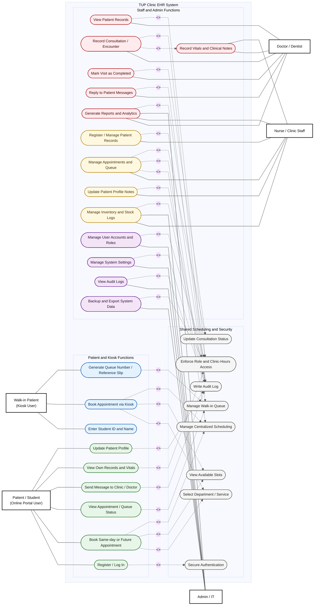

# TUP Clinic EHR - General Use Case Diagram

The diagram below follows the same general style as the sample: actors outside the system boundary, colored oval use cases inside the system, and dashed `<<include>>` links for shared functions.

**Legend**

| Color | Meaning |
|---|---|
| Green | Patient portal functions |
| Blue | Self-service kiosk functions |
| Red | Doctor / dentist functions |
| Yellow | Nurse / clinic staff functions |
| Purple | Admin / IT functions |
| Gray | Shared scheduling, security, audit, and access-control services |

**Scope Notes**

- Patient portal includes sign-up/login, appointment booking, messages, own records, and profile updates.
- Kiosk booking supports walk-in users who enter student details, choose service/schedule, and receive a queue number or reference.
- Staff portal includes patient management, appointments, encounters, queue/status updates, reports, inventory, settings, profile/activity, and backups.
- Access control is based on app roles: `patient`, `nurse`, `physician`, and `admin`.
- Staff access is guarded by clinic hours: 07:00 to 19:00, Asia/Manila.
