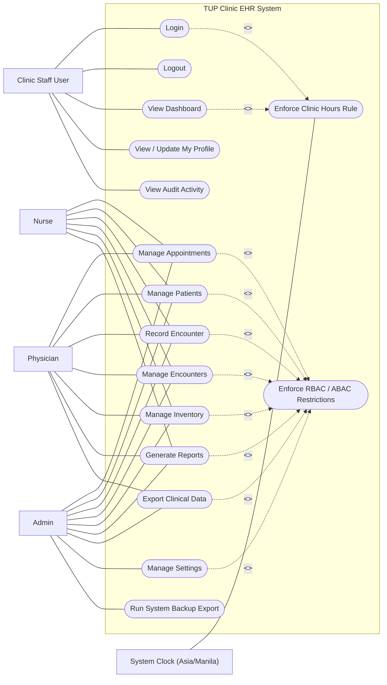

# TUP Clinic EHR - Overall Use Case Diagram

This diagram summarizes the major actors and system-wide use cases based on the current frontend + Supabase implementation.

## Notes

- `Physician` and `Admin` are modeled with elevated permissions (for example delete/export-sensitive flows).
- `Nurse` participates in core operational flows but is restricted on physician-only or high-sensitivity actions.
- Clinic-hours enforcement (`07:00-19:00`, Asia/Manila) is treated as a cross-cutting rule impacting login and protected usage.
- Access-control enforcement combines role-based and attribute/rule-based checks (RBAC + ABAC + RuleBAC).
