# TUP Clinic EHR - General Use Case Diagram

This general use case diagram is based on a scan of the current React/Vite site, including the staff/admin routes, patient portal routes, kiosk booking flow, Supabase schema, and security/access-control files.

```mermaid
flowchart LR
  Patient["Patient / Student<br/>(Online Patient Portal User)"]
  KioskUser["Walk-in Patient<br/>(Self-Service Kiosk User)"]
  Physician["Physician / Dentist"]
  Nurse["Nurse / Clinic Staff"]
  Admin["Admin / IT"]
  Clock["System Clock<br/>(Asia/Manila)"]
  Supabase[("Supabase<br/>Database / Auth / Storage")]

  subgraph SYS["TUP Clinic EHR System"]
    direction LR

    subgraph PATIENT_PORTAL["Patient Portal Functions"]
      direction TB
      P1([Register Patient Account])
      P2([Log In / Log Out])
      P3([View Patient Dashboard])
      P4([Book Same-day Appointment])
      P5([Book Future Appointment])
      P6([Select Department and Service])
      P7([View Available Appointment Slots])
      P8([Receive Queue Number or Reference Code])
      P9([View Appointment Summary])
      P10([Send Clinic / Doctor Message])
      P11([View Encounter Records and Vitals])
      P12([Update Patient Profile])
    end

    subgraph KIOSK["Self-Service Kiosk Functions"]
      direction TB
      K1([Enter Student ID and Name])
      K2([Select Clinic Department])
      K3([Select Appointment Type])
      K4([Select Service and Available Slot])
      K5([Submit Walk-in / Future Booking])
      K6([Generate Queue Number or Reference])
    end

    subgraph STAFF_OPS["Staff Clinical Operations"]
      direction TB
      S1([View Staff Dashboard])
      S2([Search Student / Patient])
      S3([Register or Add Patient])
      S4([Manage Appointments])
      S5([Update Appointment Status])
      S6([Manage Walk-in Queue])
      S7([Open Patient Profile])
      S8([Update Patient Medications, Allergies, Notes])
      S9([Create New Encounter])
      S10([Record Vitals])
      S11([Document HPI, Exam, Assessment and Plan])
      S12([Mark Encounter Complete])
      S13([Review Encounter History])
      S14([Reply to Patient Messages])
    end

    subgraph REPORTING["Reports, Inventory, and Administration"]
      direction TB
      R1([Generate Census Report])
      R2([Generate Diagnosis Analytics])
      R3([Generate Visit Trend Analytics])
      R4([Export CSV / PDF Reports])
      R5([Export Patient Profile PDF])
      R6([Export Census Data])
      I1([View Inventory Stock Levels])
      I2([Add Inventory Item])
      I3([Adjust Stock In / Out])
      I4([Review Inventory Transactions])
      I5([Receive Low Stock Alerts])
      I6([Delete Inventory Item])
      A1([Manage App Settings])
      A2([Change Account Password])
      A3([View Own Profile and Activity])
      A4([Backup All System Data])
      A5([Manage User Accounts and Roles])
      A6([View Audit Logs])
    end

    subgraph SECURITY["Shared Security and System Services"]
      direction TB
      X1([Secure Authentication])
      X2([Enforce Portal Surface Rules])
      X3([Enforce Clinic Hours])
      X4([Enforce RBAC / ABAC Permissions])
      X5([Restrict Sensitive Clinical Fields])
      X6([Verify Password for Destructive / Export Actions])
      X7([Write Audit Log])
      X8([Persist and Retrieve EHR Data])
    end
  end

  Patient --- P1
  Patient --- P2
  Patient --- P3
  Patient --- P4
  Patient --- P5
  Patient --- P9
  Patient --- P10
  Patient --- P11
  Patient --- P12

  KioskUser --- K1
  KioskUser --- K2
  KioskUser --- K3
  KioskUser --- K4
  KioskUser --- K5
  KioskUser --- K6

  Physician --- S1
  Physician --- S2
  Physician --- S3
  Physician --- S4
  Physician --- S5
  Physician --- S6
  Physician --- S7
  Physician --- S8
  Physician --- S9
  Physician --- S10
  Physician --- S11
  Physician --- S12
  Physician --- S13
  Physician --- S14
  Physician --- R1
  Physician --- R2
  Physician --- R3
  Physician --- R4
  Physician --- R5
  Physician --- R6
  Physician --- I1
  Physician --- I2
  Physician --- I3
  Physician --- I4
  Physician --- I5
  Physician --- I6
  Physician --- A1
  Physician --- A2
  Physician --- A3
  Physician --- A4
  Physician --- A6

  Nurse --- S1
  Nurse --- S2
  Nurse --- S3
  Nurse --- S4
  Nurse --- S5
  Nurse --- S6
  Nurse --- S7
  Nurse --- S8
  Nurse --- S9
  Nurse --- S10
  Nurse --- S13
  Nurse --- R1
  Nurse --- R2
  Nurse --- R3
  Nurse --- I1
  Nurse --- I2
  Nurse --- I3
  Nurse --- I4
  Nurse --- I5
  Nurse --- A2
  Nurse --- A3

  Admin --- S1
  Admin --- S2
  Admin --- S3
  Admin --- S4
  Admin --- S5
  Admin --- S6
  Admin --- S7
  Admin --- S8
  Admin --- S9
  Admin --- S10
  Admin --- S11
  Admin --- S12
  Admin --- S13
  Admin --- R1
  Admin --- R2
  Admin --- R3
  Admin --- R4
  Admin --- R5
  Admin --- R6
  Admin --- I1
  Admin --- I2
  Admin --- I3
  Admin --- I4
  Admin --- I5
  Admin --- I6
  Admin --- A1
  Admin --- A2
  Admin --- A3
  Admin --- A4
  Admin --- A5
  Admin --- A6

  P1 -. "include" .-> X1
  P2 -. "include" .-> X1
  P2 -. "include" .-> X2
  P3 -. "include" .-> X8
  P4 -. "include" .-> P6
  P4 -. "include" .-> P7
  P4 -. "include" .-> P8
  P5 -. "include" .-> P6
  P5 -. "include" .-> P7
  P5 -. "include" .-> P8
  P10 -. "include" .-> X8
  P11 -. "include" .-> X8
  P12 -. "include" .-> X8

  K5 -. "include" .-> K1
  K5 -. "include" .-> K2
  K5 -. "include" .-> K3
  K5 -. "include" .-> K4
  K5 -. "include" .-> K6
  K5 -. "include" .-> X8

  S1 -. "include" .-> X3
  S1 -. "include" .-> X8
  S3 -. "include" .-> S2
  S3 -. "include" .-> X7
  S4 -. "include" .-> X4
  S4 -. "include" .-> X8
  S5 -. "include" .-> X7
  S6 -. "include" .-> S5
  S7 -. "include" .-> X4
  S8 -. "include" .-> X7
  S9 -. "include" .-> S2
  S9 -. "include" .-> S10
  S9 -. "include" .-> S11
  S9 -. "include" .-> X7
  S11 -. "include" .-> X5
  S12 -. "include" .-> X7
  S13 -. "include" .-> X5
  S14 -. "include" .-> X8

  R1 -. "include" .-> X8
  R2 -. "include" .-> X8
  R3 -. "include" .-> X8
  R4 -. "include" .-> X6
  R5 -. "include" .-> X6
  R6 -. "include" .-> X6
  I2 -. "include" .-> X7
  I3 -. "include" .-> X7
  I6 -. "include" .-> X6
  I6 -. "include" .-> X7
  A1 -. "include" .-> X8
  A4 -. "include" .-> X6
  A4 -. "include" .-> X8
  A5 -. "include" .-> X4
  A6 -. "include" .-> X8

  X3 --- Clock
  X8 --- Supabase
  X1 --- Supabase
  X4 --- Supabase
  X7 --- Supabase

  classDef actor fill:#ffffff,stroke:#222,color:#111,stroke-width:2px;
  classDef patientUC fill:#e8f5e9,stroke:#2e7d32,color:#103b18;
  classDef kioskUC fill:#e3f2fd,stroke:#1565c0,color:#0b305f;
  classDef staffUC fill:#fff3e0,stroke:#ef6c00,color:#4a2600;
  classDef reportUC fill:#fce4ec,stroke:#ad1457,color:#4a0a24;
  classDef securityUC fill:#f5f5f5,stroke:#616161,color:#222;
  classDef external fill:#f7f7ff,stroke:#4a4a8a,color:#111;

  class Patient,KioskUser,Physician,Nurse,Admin actor;
  class Clock,Supabase external;
  class P1,P2,P3,P4,P5,P6,P7,P8,P9,P10,P11,P12 patientUC;
  class K1,K2,K3,K4,K5,K6 kioskUC;
  class S1,S2,S3,S4,S5,S6,S7,S8,S9,S10,S11,S12,S13,S14 staffUC;
  class R1,R2,R3,R4,R5,R6,I1,I2,I3,I4,I5,I6,A1,A2,A3,A4,A5,A6 reportUC;
  class X1,X2,X3,X4,X5,X6,X7,X8 securityUC;
```

## Legend

- Solid line: actor participates in the use case.
- Dotted line: included/shared behavior used by another use case.
- Green: patient portal functions.
- Blue: self-service kiosk functions.
- Orange: clinic staff clinical operations.
- Pink: reporting, inventory, settings, backup, and admin functions.
- Gray: shared authentication, access control, clinic-hours, audit, and database services.

## Scope Notes

- Staff portal routes are protected for `admin`, `physician`, and `nurse` roles.
- Patient portal routes are protected for the `patient` role and are deployed separately with `VITE_DEPLOY_SURFACE=user`.
- The kiosk booking route is public on the user surface and stores appointments with `source = kiosk`.
- Staff/admin access is limited to clinic hours, 07:00 to 19:00 in the Asia/Manila timezone.
- Sensitive actions such as destructive deletes, report exports, census exports, patient PDF exports, and full backups require elevated permission and/or password verification.
- Nurse access is restricted for physician-only clinical fields such as `assessment_plan`, especially on high-sensitivity records.
